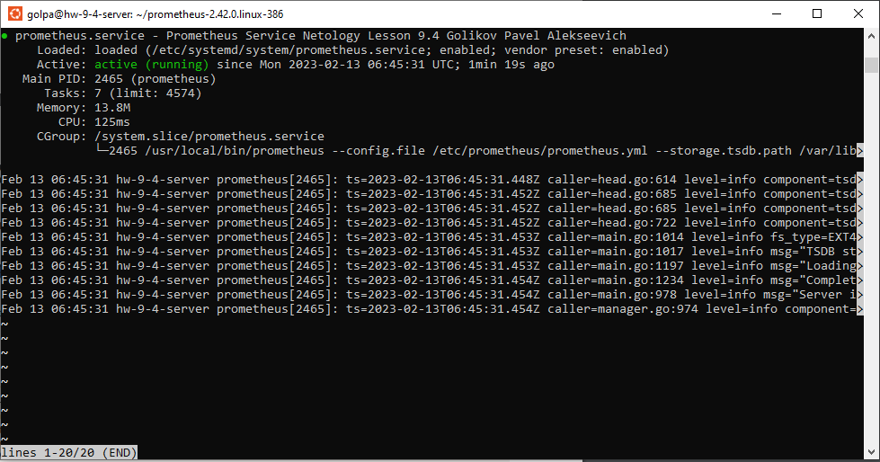
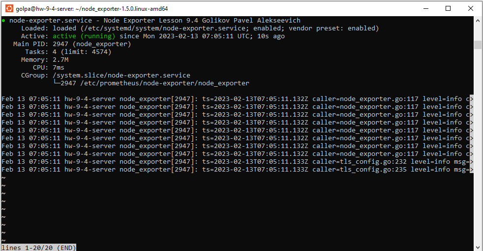
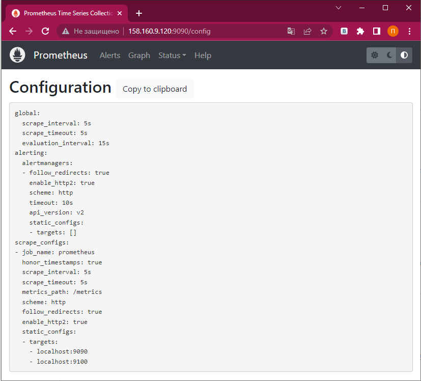
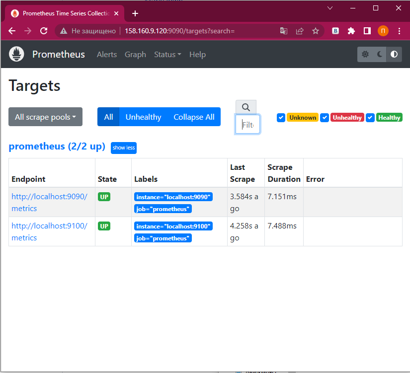
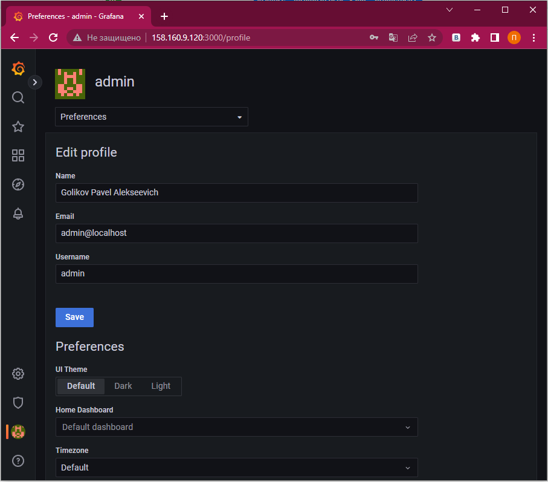
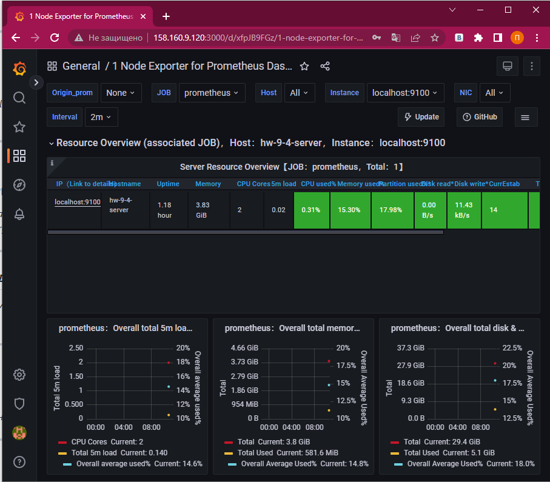

# Домашнее задание к занятию 9.4 «Prometheus»

### Задание 1

Установите Prometheus.

*Приведите скриншот systemctl status prometheus, где будет написано: prometheus.service — Prometheus Service Netology Lesson 9.4 — [Ваши ФИО].*

---

### Задание 2

Установите Node Exporter.

*Приведите скриншот systemctl status node-exporter, где будет написано: node-exporter.service — Node Exporter Netology Lesson 9.4 — [Ваши ФИО].*

---

### Задание 3

Подключите Node Exporter к серверу Prometheus.

*Приложите скриншот конфига из интерфейса Prometheus вкладки Status > Configuration.*

*Приложите скриншот из интерфейса Prometheus вкладки Status > Targets, чтобы было видно минимум два эндпоинта.*

---
## Дополнительные задания со звёздочкой*

Эти задания дополнительные. Их можно не выполнять. Это не повлияет на зачёт. Вы можете их выполнить, если хотите глубже разобраться в материале.

---

### Задание 4*

Установите Grafana.

*Приложите скриншот левого нижнего угла интерфейса, чтобы при наведении на иконку пользователя были видны ваши ФИО.*

---

### Задание 5*

Интегрируйте Grafana и Prometheus.

*Приложите скриншот дашборда (ID:11074) с поступающими туда данными из Node Exporter.*

